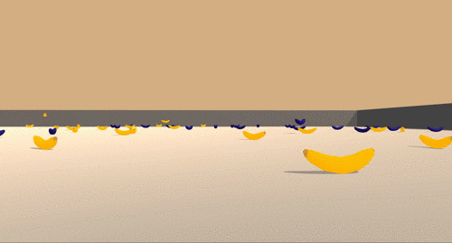

# README

## Project details
Work in this repository is part of my nanodegree in Deep Reinforcement Learning with Udacity.

This repo is aimed at practicing value-based methods from reinforcement learning by solving an environment similar to Banana Collector.
The agent plays a game of navigating in a contained space full of yellow bananas (+1 point) and blue bananas (-1 point). It's goal is to collect as many points as possible over a game episode taking 299 seconds.

The state space has 37 dimensions and contains the agent's velocity and the perception of objects around it. Four actions are available to navigate through the banana world:
- 0: move forward.
- 1: move backward.
- 2: turn left.
- 3: turn right.

Environment is considered solved when agent achieves average score of 13 over 100 episodes.

## Getting started
The recommended way of installing dependencies to run this project is to follow instructions here https://github.com/udacity/Value-based-methods#dependencies to install a minimal version of OpenAI gym. 

Then it is recommended to install Unity Environment or download an already built environment.

## Instructions
Main file of this repository is "Navigation.ipynb". It is using the environment to train the agent. The notebook contains instructions on how to run it.

## Saved model
Saved model weights can be found in model folder.
