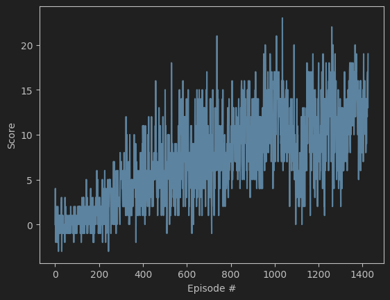

# Project report

## Description of the implementation

### Environment
This project is based on a Unity Environment prepared by Udacity's team.

## Learning Algorithm
Environment was solved using a DQN with a prioritized experience replay modification.

### Learning algorithm
DQN stands for Deep Q-Network. It's a type of reinforcement learning algorithm that combines Q-learning with deep neural networks.

In traditional Q-learning, Q-values are stored in a table, which can become impractical for environments with large state spaces. DQN addresses this limitation by using a neural network to approximate the Q-value function, enabling it to manage much larger and more complex state spaces.

Additionally, DQN employs a technique called experience replay. This involves the agent storing its experiences—comprising the state, action, reward, and next state—in a memory buffer. During training, the agent samples random experiences from this buffer, which helps break the correlation between consecutive experiences and stabilizes the training process.

### Prioritized Experience Replay
To solve the environment, Prioritized Experience Replay was implemented. It is an enhancement to the standard experience replay technique used in reinforcement learning. Instead of sampling experiences uniformly from the memory buffer, it prioritizes experiences that are deemed more important for learning, typically based on the magnitude of their temporal-difference error. This allows the agent to learn more efficiently by focusing on experiences that are likely to provide greater learning value, leading to improved performance and faster convergence.

### Neural network architecture
The network used in this project takes an input a vector of 37 elements describing the state. It consists of 3 fully connected layers (sizes 256, 128 and 64).
The output layer of consists of 4 neurons (as there are 4 possible actions).

### Hyperparameters
- BUFFER_SIZE = 10000 - replay buffer size
- BATCH_SIZE = 100 - minibatch size
- GAMMA = 0.95 - discount factor
- TAU = 1e-2 - for soft update of target parameters
- LR = 5e-4 - learning rate
- UPDATE_EVERY = 50 - how often to update the network
- EPSILON = 0.05 - threshold for epsilon-greedy policy

## Plot of Rewards
A plot of rewards per episode. 

## Ideas for Future Work
The performance of the agent could be improved by:
- tuning hyperparameters
- increased training duration
- implementing a dueling DQN 

## Saved model
Saved model weights can be found in model folder.
